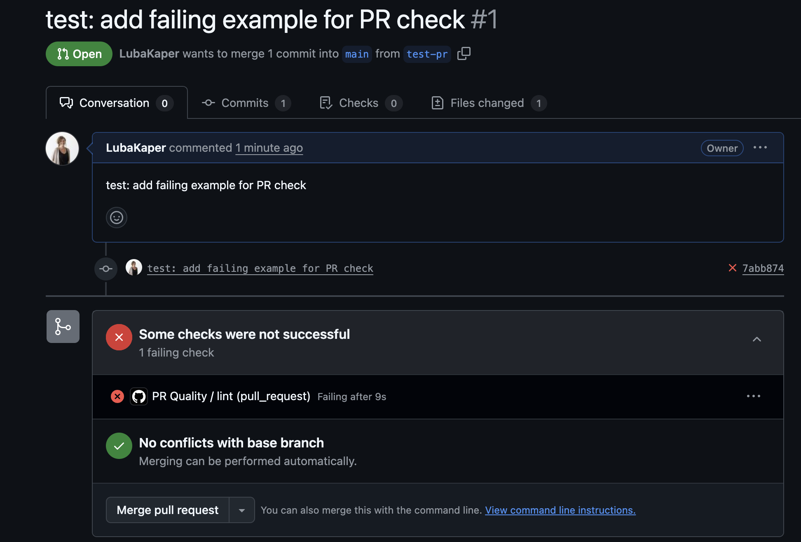
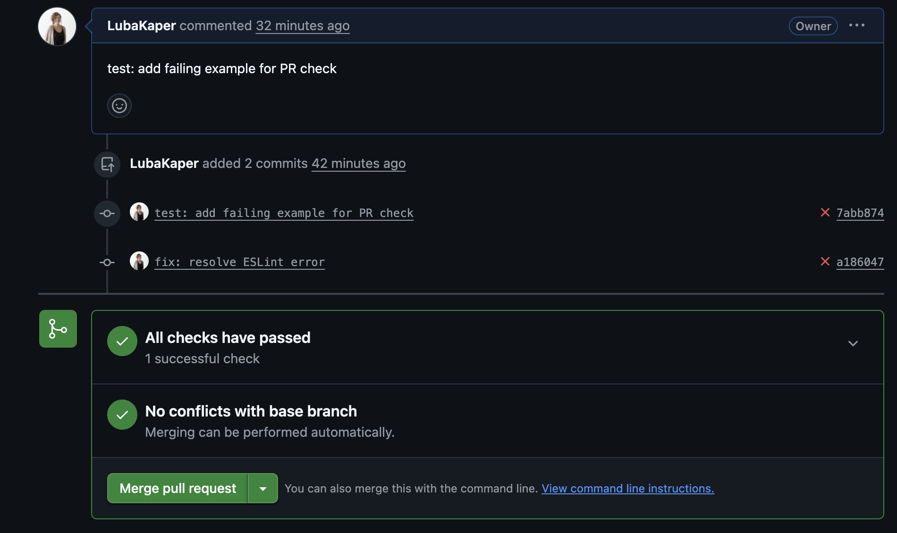

# Code-Review MVP

✨ Lightweight Automated Code Review Workflow

This project is a minimal, working code review assistant. It automatically fixes small issues and enforces clean code in pull requests so reviewers can focus on logic, not formatting.

⸻

## 🚀 Features

• Auto-fix on save/commit with ESLint + Prettier + Husky.  
• PR checks via GitHub Actions (runs lint + format check).  
• Fast setup — add one workflow file and you’re done.  
• Keeps repos clean — reviewers focus on logic, not style.

⸻

## 📦 Quick Start (Local)

```bash
# clone your repo
git clone https://github.com/your-username/code-review-mvp.git
cd code-review-mvp

# install dependencies
npm install

# enable husky (for pre-commit hooks)
npx husky init
```

• Save a file → Prettier formats automatically.  
• Commit → Husky + lint-staged auto-fix small issues.

⸻

## 🔄 GitHub Action (PR Checks)

This workflow runs on every Pull Request:

```yaml
name: PR Quality
on: [pull_request]
jobs:
  lint:
    runs-on: ubuntu-latest
    steps:
      - uses: actions/checkout@v4
      - uses: actions/setup-node@v4
        with:
          node-version: '20'
      - run: npm ci || npm i
      - run: npm run lint
      - run: npm run format -- --check
```

⸻

## 🧑‍💻 Example

**Failing PR (before):**  


**Passing PR (after):**  


_Local commits (Husky):_ When committing locally, Husky + lint-staged run Prettier/ESLint:  
• Small issues (spacing, semicolons) → auto-fixed.  
• Serious issues (like undefined variables) → commit blocked.

⸻

## ✅ What This Workflow Enforces

This setup combines **Prettier** (for formatting) and **ESLint** (for code quality).

### Prettier (auto-fixes style issues)

- Always add semicolons
- Use single quotes (`'`) instead of double quotes (`"`)
- Add trailing commas where possible
- Consistent spacing and indentation
- Wrap lines longer than 100 characters

**Example (auto-fixed):**

```js
// Before commit
const arr = [1, 2, 3];
console.log('hello');

// After Prettier auto-fix
const arr = [1, 2, 3];
console.log('hello');
```

### ESLint (checks for errors & best practices)

- no-undef → blocks commits if you use variables that don’t exist
- no-unused-vars → warns if you declare variables you never use
- no-console → normally warns on console.log, but disabled in this setup
- Basic JavaScript syntax validation (missing brackets, typos, etc.)

**_Example (blocked commit):_**

```js
// Before commit
let foo = 42;
console.log(bar); // ❌ ESLint error: 'bar' is not defined
```

In short:

- Messy code → auto-formatted by Prettier before commit.
- Broken code → blocked by ESLint until fixed.

⸻

## 🎯 Why This Matters

Code reviews often waste time on small style issues. This workflow:
• Reduces noise (no more “add a semicolon” comments).
• Saves time for both authors and reviewers.
• Keeps code clean and consistent across projects.

⸻

## ❓ Why Use This Repo?

Setting up automated code checks from scratch can be complicated.
Without this repo, you would need to:

- Install and configure ESLint, Prettier, Husky, and lint-staged separately.
- Figure out the new ESLint v9 flat config format.
- Write your own Husky pre-commit hooks and lint-staged rules.
- Create and configure a GitHub Action workflow manually.

This repo saves you all that effort — it’s a ready-to-use **starter kit**.
Just clone, run `npm install`, and you get:

- Husky + lint-staged pre-commit checks
- ESLint + Prettier config already set up
- GitHub Action workflow for PR quality

⸻

## 🔍 Before vs After

| Situation         | Without This Workflow 😬                                           | With This Workflow 🚀                                                               |
| ----------------- | ------------------------------------------------------------------ | ----------------------------------------------------------------------------------- |
| **Local commits** | Any code can be committed — even broken or messy.                  | Husky + lint-staged run Prettier/ESLint → auto-fix small issues, block bad commits. |
| **Pull Requests** | Messy or broken code can be pushed and merged.                     | GitHub Action runs lint + format checks → PRs must pass before merging.             |
| **Code reviews**  | Reviewers waste time on “fix spacing” or “add semicolon” comments. | Reviewers focus on logic and design, not style issues.                              |
| **Consistency**   | Code style varies by developer.                                    | Prettier + ESLint enforce the same rules everywhere.                                |

**In short: no more messy PRs — just clean, consistent code.**

⸻

## 📌 Roadmap

- [x] Add ESLint + Prettier setup
- [x] Add Husky + lint-staged pre-commit hooks
- [x] Add GitHub Action for PR checks
- [ ] Add reusable GitHub Action (uses: code-review-mvp@v1)
- [ ] Add Danger rule (warn if PR too big or missing description)
- [ ] Add optional TypeScript support (tsc --noEmit)

⸻

## 📄 License

MIT License © 2025 Luba Kaper

```

```
